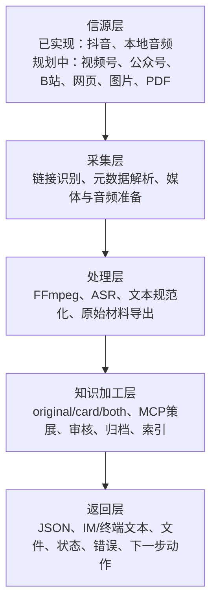
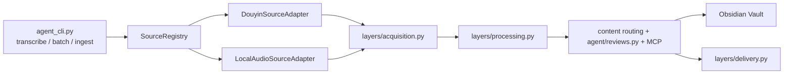

# AI外脑 1.2 Five-Layer Architecture

## Product Architecture



Only Douyin and local audio are implemented source adapters. Planned sources are extension targets, not current product claims.

## Technical Architecture



The orchestration layer connects the five product layers but is not presented as a sixth product layer.

## Layered JSON

Every ingest/transcribe item exposes:

- `source`
- `acquisition`
- `processing`
- `knowledge`
- `delivery`
- `next`

Existing flat fields remain unchanged for older agents and skills.

## Canonical failure contract

Failures shared across the five layers use:

```json
{
  "stage": "processing",
  "error_code": "asr_unavailable",
  "error": "ASR 环境不可用",
  "recoverable": true
}
```

- `stage` is one of `source`, `acquisition`, `processing`, `knowledge`, or
  `delivery`.
- `error_code` is a stable non-empty snake_case machine code.
- `error` is a user-readable UTF-8 message.
- `recoverable` means retry may succeed after the input or environment is
  corrected; it does not authorize automatic retry.

Legacy aliases are projected only at the Delivery compatibility boundary:
`input` maps to `source`, `asr` to `processing`, and `review` to `knowledge`.
Explicit stages take precedence over old message-based inference.
